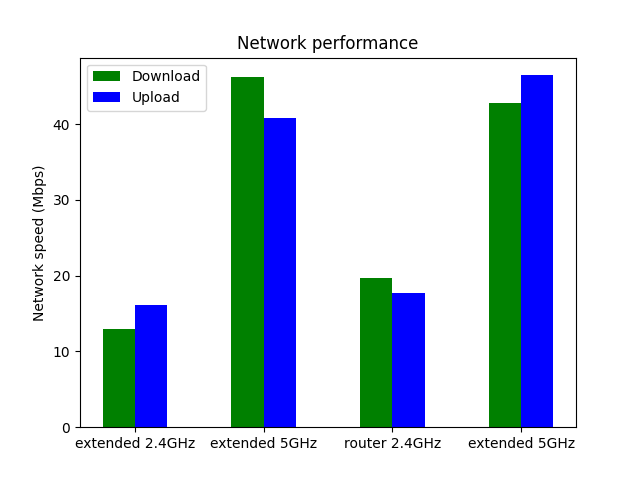

# Internet speedtest scripts

These scripts test internet connection using
[speedtest](https://www.speedtest.net/apps/cli), save the results, and turn
aggregates of the results into nice pretty bar charts comparing performance
across different bands and different networks.

I wrote these scripts because I got tired of manually comparing the internet
performances of our router vs a new extender. Also, bar charts are easier for
my monkey brain to understand than lists of numbers.

# Usage

Run the shell script first, move the files into a new subdirectory called
`data/`, and then run the Python script. The Python will yield a graph named
`results.png`.

## Example
```sh
~/wifi-speedtests (main) $ ./run_speedtests.sh router 2.4GHz
Running test 0...
Download: 11.64 Mbit/s
Upload: 3.12 Mbit/s

Running test 1...
Download: 20.55 Mbit/s
Upload: 6.53 Mbit/s

Running test 2...
Download: 15.16 Mbit/s
Upload: 4.60 Mbit/s

Running test 3...
Download: 12.59 Mbit/s
Upload: 5.75 Mbit/s

Running test 4...
Download: 19.00 Mbit/s
Upload: 6.89 Mbit/s

Running test 5...
Download: 20.42 Mbit/s
Upload: 8.10 Mbit/s
```

The script generated a file called `router_2.4GHz.txt` inside a subdirectory
called `data` (which it created if `data` didn't already exist). 

Then, change to a different network and run the script again. Repeat as
necessary.

Once you are satisfied with the contents of `data/`, you can run `python3
graph_speedtest_data.py`. The Python will yield a bar chart called
`results.png`, in which each network (i.e., each datafile in `data/`) is
represented by two bars, the green one being download speed and the blue one
being upload speed. 

# License
Released under the MIT License.
